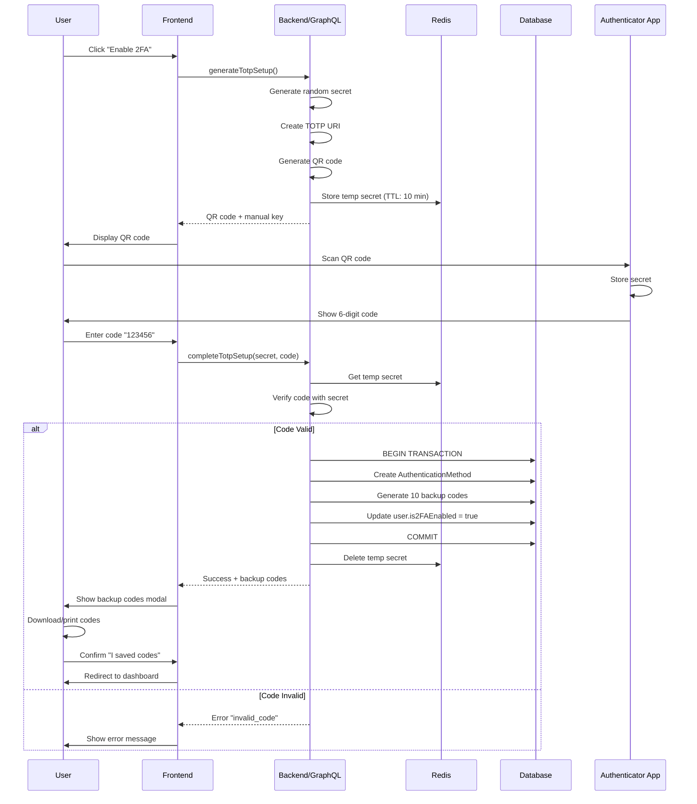
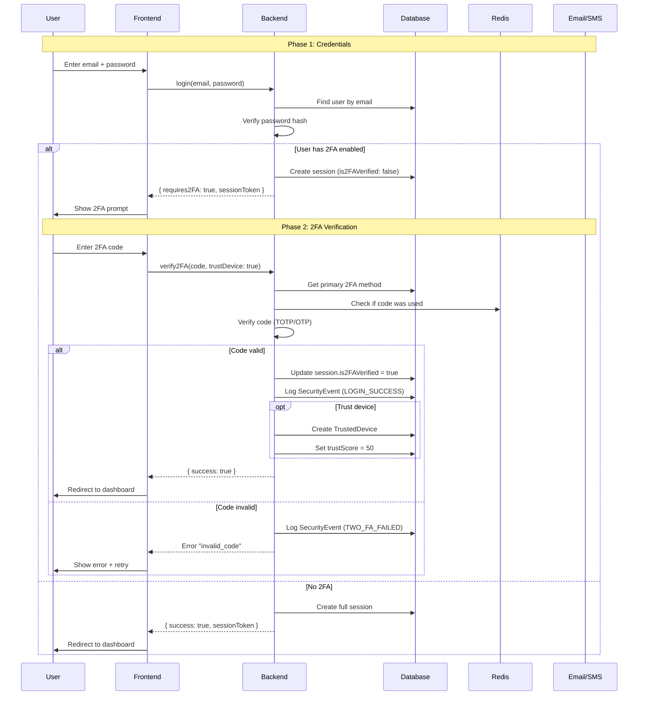

# 2FA Flow Diagrams

Визуальные диаграммы всех потоков работы с 2FA системой.

## 📋 Table of Contents

1. [TOTP Setup Flow](#totp-setup-flow)
2. [OTP Setup Flow](#otp-setup-flow)
3. [Login with 2FA Flow](#login-with-2fa-flow)
4. [Backup Code Recovery Flow](#backup-code-recovery-flow)
5. [Device Trust Flow](#device-trust-flow)
6. [Risk Assessment Flow](#risk-assessment-flow)
7. [Method Management Flow](#method-management-flow)

---

## TOTP Setup Flow

### High-Level Overview

```
┌─────────────┐
│   User      │
│ Dashboard   │
└──────┬──────┘
       │
       │ Clicks "Enable 2FA"
       ▼
┌─────────────────────────────────────────────────────────────┐
│                    TOTP Setup Process                        │
├─────────────────────────────────────────────────────────────┤
│                                                              │
│  Step 1: Generate QR Code                                   │
│  ┌────────────────────────────────────────────────────┐    │
│  │ Frontend → generateTotpSetup()                      │    │
│  │ Backend  → Generate secret + QR code                │    │
│  │ Redis    → Store temp secret (10 min TTL)           │    │
│  │ Response → QR code + manual entry key                │    │
│  └────────────────────────────────────────────────────┘    │
│                          ↓                                   │
│  Step 2: User Scans QR                                      │
│  ┌────────────────────────────────────────────────────┐    │
│  │ User opens authenticator app                        │    │
│  │ Scans QR code                                        │    │
│  │ App shows 6-digit code (changes every 30s)          │    │
│  └────────────────────────────────────────────────────┘    │
│                          ↓                                   │
│  Step 3: Verify Code                                        │
│  ┌────────────────────────────────────────────────────┐    │
│  │ User enters code in form                            │    │
│  │ Frontend → completeTotpSetup(secret, code)          │    │
│  │ Backend  → Verify code matches secret               │    │
│  │ Database → Create AuthenticationMethod              │    │
│  │ Database → Generate 10 backup codes                 │    │
│  │ Response → Success + backup codes                   │    │
│  └────────────────────────────────────────────────────┘    │
│                          ↓                                   │
│  Step 4: Save Backup Codes                                  │
│  ┌────────────────────────────────────────────────────┐    │
│  │ Display backup codes (ONLY ONCE!)                   │    │
│  │ User downloads/prints codes                         │    │
│  │ User confirms codes are saved                       │    │
│  └────────────────────────────────────────────────────┘    │
│                                                              │
└──────────────────────────┬───────────────────────────────────┘
                           │
                           ▼
                    ┌──────────────┐
                    │ 2FA Enabled  │
                    │   ✅ Done    │
                    └──────────────┘
```

### Detailed Sequence Diagram



---

## OTP Setup Flow

### Email OTP Flow

```
┌─────────────┐
│    User     │
└──────┬──────┘
       │
       │ Selects "Email OTP"
       ▼
┌─────────────────────────────────────────────────────────────┐
│               Email OTP Setup Process                        │
├─────────────────────────────────────────────────────────────┤
│                                                              │
│  Step 1: Enter Email                                        │
│  ┌────────────────────────────────────────────────────┐    │
│  │ User enters email address                           │    │
│  │ Frontend → setupOtp(method: EMAIL, email)           │    │
│  │ Backend  → Validate email format                    │    │
│  │ Database → Create method (isActive: false)          │    │
│  │ Response → methodId                                 │    │
│  └────────────────────────────────────────────────────┘    │
│                          ↓                                   │
│  Step 2: Send Verification Code                             │
│  ┌────────────────────────────────────────────────────┐    │
│  │ Frontend → sendOtpCode(methodId)                    │    │
│  │ Backend  → Generate 6-digit code                    │    │
│  │ Backend  → Hash code (Argon2id)                     │    │
│  │ Redis    → Store hashed code (TTL: 5 min)           │    │
│  │ Email    → Send code to user                        │    │
│  │ Response → Success                                  │    │
│  └────────────────────────────────────────────────────┘    │
│                          ↓                                   │
│  Step 3: User Receives Email                                │
│  ┌────────────────────────────────────────────────────┐    │
│  │ ✉️ "Your verification code is: 123456"             │    │
│  │ Code expires in 5 minutes                           │    │
│  └────────────────────────────────────────────────────┘    │
│                          ↓                                   │
│  Step 4: Verify Code                                        │
│  ┌────────────────────────────────────────────────────┐    │
│  │ User enters code from email                         │    │
│  │ Frontend → verifyOtpSetup(methodId, code)           │    │
│  │ Redis    → Get stored hashed code                   │    │
│  │ Backend  → Verify code matches                      │    │
│  │ Database → Update method.isActive = true            │    │
│  │ Database → Generate backup codes                    │    │
│  │ Response → Success + backup codes                   │    │
│  └────────────────────────────────────────────────────┘    │
│                                                              │
└──────────────────────────┬───────────────────────────────────┘
                           │
                           ▼
                    ┌──────────────┐
                    │Email OTP     │
                    │  Enabled ✅  │
                    └──────────────┘
```

### SMS OTP Flow

```
Same as Email OTP, but:
- Step 2: Send via Twilio SMS instead of email
- Phone number must be E.164 format (+1234567890)
- Additional validation: check if SMS can be sent to country
```

---

## Login with 2FA Flow

### Complete Login Process

```
┌─────────────┐
│    User     │
└──────┬──────┘
       │
       │ Navigates to /login
       ▼
┌─────────────────────────────────────────────────────────────┐
│                  Login with 2FA Flow                         │
├─────────────────────────────────────────────────────────────┤
│                                                              │
│  Phase 1: Credentials                                       │
│  ┌────────────────────────────────────────────────────┐    │
│  │ User enters email + password                        │    │
│  │ Frontend → login(email, password)                   │    │
│  │ Backend  → Verify credentials                       │    │
│  │ Database → Check user exists                        │    │
│  │ Backend  → Verify password hash                     │    │
│  └────────────────────────────────────────────────────┘    │
│                          ↓                                   │
│                   ┌──────────────┐                          │
│                   │ Credentials  │                          │
│                   │   Valid?     │                          │
│                   └──────┬───────┘                          │
│                          │                                   │
│              ┌───────────┴───────────┐                      │
│              ▼                       ▼                       │
│         ┌─────────┐            ┌──────────┐                │
│         │   NO    │            │   YES    │                │
│         └────┬────┘            └────┬─────┘                │
│              │                      │                       │
│              │                      ▼                       │
│              │              Check: user.is2FAEnabled?       │
│              │                      │                       │
│              │              ┌───────┴────────┐              │
│              │              ▼                ▼              │
│              │         ┌────────┐      ┌─────────┐         │
│              │         │  NO    │      │   YES   │         │
│              │         └───┬────┘      └────┬────┘         │
│              ▼             │                 │              │
│         ┌────────┐         │                 │              │
│         │ Error  │         ▼                 ▼              │
│         │"Invalid│  ┌─────────────┐  ┌──────────────┐     │
│         │ creds" │  │Create full  │  │Create partial│     │
│         └────────┘  │  session    │  │   session    │     │
│                     │             │  │              │     │
│                     │✅ Logged In │  │requires2FA:  │     │
│                     └─────────────┘  │    true      │     │
│                                      └──────┬───────┘     │
│                                             │              │
│  Phase 2: 2FA Verification                 │              │
│  ┌──────────────────────────────────────────┘              │
│  │                                                          │
│  │  User sees 2FA prompt                                   │
│  │  ┌────────────────────────────────────────────────┐    │
│  │  │ User enters code from authenticator             │    │
│  │  │ Frontend → verify2FA(code, trustDevice)         │    │
│  │  │ Backend  → Get user's primary method            │    │
│  │  │ Backend  → Verify code (TOTP/OTP/backup)        │    │
│  │  │ Database → Update session.is2FAVerified = true  │    │
│  │  │ Database → Log SecurityEvent                    │    │
│  │  └────────────────────────────────────────────────┘    │
│  │                      ↓                                   │
│  │              ┌──────────────┐                           │
│  │              │ Code Valid?  │                           │
│  │              └──────┬───────┘                           │
│  │                     │                                    │
│  │         ┌───────────┴───────────┐                       │
│  │         ▼                       ▼                        │
│  │    ┌─────────┐            ┌──────────┐                 │
│  │    │   NO    │            │   YES    │                 │
│  │    └────┬────┘            └────┬─────┘                 │
│  │         │                      │                        │
│  │         │                      ▼                        │
│  │         │              If trustDevice=true:             │
│  │         │              ┌────────────────────────┐       │
│  │         │              │Register device         │       │
│  │         │              │Set trust score = 50    │       │
│  │         │              │Expires in 30 days      │       │
│  │         │              └────────┬───────────────┘       │
│  │         │                       │                        │
│  │         ▼                       ▼                        │
│  │    ┌────────┐            ┌─────────────┐               │
│  │    │ Error  │            │   Success   │               │
│  │    │"Invalid│            │  Logged In  │               │
│  │    │  code" │            │     ✅      │               │
│  │    └────────┘            └─────────────┘               │
│  │                                                          │
└──┴──────────────────────────────────────────────────────────┘
```

### Sequence Diagram



---

## Backup Code Recovery Flow

### Lost Access Recovery

```
┌─────────────┐
│    User     │
│ Lost phone  │
│  😱 Panic   │
└──────┬──────┘
       │
       │ Can't access authenticator
       ▼
┌─────────────────────────────────────────────────────────────┐
│              Backup Code Recovery Flow                       │
├─────────────────────────────────────────────────────────────┤
│                                                              │
│  Step 1: Login Normally                                     │
│  ┌────────────────────────────────────────────────────┐    │
│  │ User enters email + password                        │    │
│  │ System asks for 2FA code                            │    │
│  └────────────────────────────────────────────────────┘    │
│                          ↓                                   │
│  Step 2: Select "Use Backup Code"                          │
│  ┌────────────────────────────────────────────────────┐    │
│  │ User clicks "Can't access your authenticator?"      │    │
│  │ UI shows backup code input field                    │    │
│  └────────────────────────────────────────────────────┘    │
│                          ↓                                   │
│  Step 3: Enter Backup Code                                  │
│  ┌────────────────────────────────────────────────────┐    │
│  │ User retrieves saved backup code                    │    │
│  │ Enters code (e.g., "A1B2C3D4")                      │    │
│  │ Frontend → verifyBackupCode(code)                   │    │
│  └────────────────────────────────────────────────────┘    │
│                          ↓                                   │
│  Step 4: Verify Backup Code                                 │
│  ┌────────────────────────────────────────────────────┐    │
│  │ Backend  → Get unused backup codes                  │    │
│  │ Backend  → Hash input and compare                   │    │
│  │ Database → Mark code as used (usedAt = now)         │    │
│  │ Database → Update session.is2FAVerified = true      │    │
│  │ Response → Success                                  │    │
│  └────────────────────────────────────────────────────┘    │
│                          ↓                                   │
│  Step 5: Warning & Recommendations                          │
│  ┌────────────────────────────────────────────────────┐    │
│  │ ⚠️ "You have X backup codes remaining"             │    │
│  │                                                      │    │
│  │ Recommendations:                                     │    │
│  │ 1. Setup new authenticator on new device            │    │
│  │ 2. Regenerate backup codes                          │    │
│  │ 3. Add alternative 2FA method (email/SMS)           │    │
│  │                                                      │    │
│  │ [Setup New Authenticator] [Regenerate Codes]        │    │
│  └────────────────────────────────────────────────────┘    │
│                                                              │
└──────────────────────────┬───────────────────────────────────┘
                           │
                           ▼
                    ┌──────────────┐
                    │ Access       │
                    │ Restored ✅  │
                    └──────────────┘
```

### UI Flow

```
Login Page
    │
    ├─ Enter credentials ✅
    │
    ├─ 2FA Prompt appears
    │   ┌──────────────────────────────────┐
    │   │ Enter 6-digit code               │
    │   │ [______]                         │
    │   │                                  │
    │   │ Can't access authenticator?      │
    │   │ → [Use backup code instead]  ←── Click this
    │   └──────────────────────────────────┘
    │
    └─ Backup Code Input
        ┌──────────────────────────────────┐
        │ Enter backup recovery code       │
        │ [________]                       │
        │                                  │
        │ Format: XXXXXXXX (8 characters)  │
        │                                  │
        │ [Verify Code]                    │
        │                                  │
        │ ← Back to 2FA code               │
        └──────────────────────────────────┘
```

---

## Device Trust Flow

### First Time Login from New Device

```
┌─────────────┐
│    User     │
│ New Device  │
└──────┬──────┘
       │
       │ Login from unknown device
       ▼
┌─────────────────────────────────────────────────────────────┐
│              Device Trust Workflow                           │
├─────────────────────────────────────────────────────────────┤
│                                                              │
│  Step 1: Device Detection                                   │
│  ┌────────────────────────────────────────────────────┐    │
│  │ Frontend → Collect device fingerprint:              │    │
│  │   - User agent                                       │    │
│  │   - Screen resolution                                │    │
│  │   - Timezone                                         │    │
│  │   - Language                                         │    │
│  │   - Canvas fingerprint                               │    │
│  │ Frontend → Hash fingerprint (SHA-256)                │    │
│  │ Result: deviceId = "abc123..."                       │    │
│  └────────────────────────────────────────────────────┘    │
│                          ↓                                   │
│  Step 2: Check if Device Known                              │
│  ┌────────────────────────────────────────────────────┐    │
│  │ Backend → Search TrustedDevice by deviceId          │    │
│  │ Database → No match found                            │    │
│  │ Decision: New device detected ⚠️                    │    │
│  └────────────────────────────────────────────────────┘    │
│                          ↓                                   │
│  Step 3: Require 2FA (Always)                               │
│  ┌────────────────────────────────────────────────────┐    │
│  │ Even if user enabled 2FA before,                    │    │
│  │ ALWAYS require verification on new device           │    │
│  │                                                      │    │
│  │ Show: "New device detected"                         │    │
│  │       "For security, verify your identity"          │    │
│  └────────────────────────────────────────────────────┘    │
│                          ↓                                   │
│  Step 4: User Verifies 2FA                                  │
│  ┌────────────────────────────────────────────────────┐    │
│  │ User enters 2FA code                                │    │
│  │ Backend verifies code ✅                            │    │
│  │                                                      │    │
│  │ Show: "Trust this device for 30 days?"             │    │
│  │       [Yes] [No, ask every time]                    │    │
│  └────────────────────────────────────────────────────┘    │
│                          ↓                                   │
│               ┌──────────────────────┐                      │
│               │ User clicks "Yes"?   │                      │
│               └──────┬───────────────┘                      │
│                      │                                       │
│          ┌───────────┴───────────┐                          │
│          ▼                       ▼                           │
│     ┌─────────┐            ┌──────────┐                    │
│     │   NO    │            │   YES    │                    │
│     └────┬────┘            └────┬─────┘                    │
│          │                      │                           │
│          │                      ▼                           │
│          │      Step 5: Register Trusted Device            │
│          │      ┌────────────────────────────────┐         │
│          │      │ Database → Create TrustedDevice│         │
│          │      │   - deviceId                   │         │
│          │      │   - fingerprint                │         │
│          │      │   - userAgent, browser, OS     │         │
│          │      │   - location (IP geolocation)  │         │
│          │      │   - trustScore = 50            │         │
│          │      │   - expiresAt = now + 30 days  │         │
│          │      └────────────────────────────────┘         │
│          │                      │                           │
│          ▼                      ▼                           │
│    ┌──────────────┐      ┌─────────────────┐              │
│    │2FA required  │      │ Device trusted  │              │
│    │ every login  │      │ for 30 days ✅  │              │
│    └──────────────┘      └─────────────────┘              │
│                                                              │
└──────────────────────────────────────────────────────────────┘
```

### Subsequent Logins from Trusted Device

```
User logs in from trusted device
         ↓
Backend checks:
         │
         ├─ Device exists in TrustedDevice table? ✅
         │
         ├─ Device.isActive = true? ✅
         │
         ├─ Device.expiresAt > now? ✅
         │
         └─ Device.trustScore >= 75?
                 │
          ┌──────┴───────┐
          ▼              ▼
        YES             NO
          │              │
          │              ├─ Require 2FA
          │              │  (trustScore too low)
          │              │
          │              └─ On success:
          │                 trustScore += 5
          │
          └─ Skip 2FA! ✅
             Update device.lastSeenAt
             Increment device login counter
             Increase trustScore += 5
```

### Trust Score Changes

```
Event                          | Trust Score Change
─────────────────────────────────────────────────
New device registered          | Start at 50
Successful login               | +5
Failed 2FA attempt             | -10
Login from new location        | -5
Login at unusual time          | -2
Explicitly trusted by user     | Set to 100
30 days of inactivity          | -30 (1 per day)
Suspicious activity detected   | Set to 0 + revoke
```

---

## Risk Assessment Flow

### Real-Time Risk Calculation

```
┌─────────────┐
│Login Attempt│
└──────┬──────┘
       │
       ▼
┌─────────────────────────────────────────────────────────────┐
│              Risk Assessment Engine                          │
├─────────────────────────────────────────────────────────────┤
│                                                              │
│  Collect Context Data                                       │
│  ┌────────────────────────────────────────────────────┐    │
│  │ User Context:                                       │    │
│  │   - Account age                                      │    │
│  │   - 2FA enabled?                                     │    │
│  │   - Previous locations                               │    │
│  │   - Typical login times                              │    │
│  │                                                      │    │
│  │ Current Attempt:                                     │    │
│  │   - IP address → Geolocation                        │    │
│  │   - User agent → Device info                        │    │
│  │   - Time of day                                      │    │
│  │   - Failed attempts count                            │    │
│  └────────────────────────────────────────────────────┘    │
│                          ↓                                   │
│  Calculate Risk Factors                                     │
│  ┌────────────────────────────────────────────────────┐    │
│  │                                                      │    │
│  │ 🌍 Location Risks:                                  │    │
│  │   ├─ New country? → +20 points                      │    │
│  │   ├─ High-risk country? → +25 points                │    │
│  │   └─ Impossible travel? → +40 points                │    │
│  │                                                      │    │
│  │ 📱 Device Risks:                                    │    │
│  │   ├─ New device? → +15 points                       │    │
│  │   ├─ Untrusted device? → +20 points                 │    │
│  │   └─ Suspicious user agent? → +15 points            │    │
│  │                                                      │    │
│  │ 🕐 Behavioral Risks:                                │    │
│  │   ├─ Unusual time? → +10 points                     │    │
│  │   ├─ Unusual day? → +5 points                       │    │
│  │   └─ Multiple failed attempts? → +35 points         │    │
│  │                                                      │    │
│  │ 👤 Account Risks:                                   │    │
│  │   ├─ New account (<7 days)? → +10 points           │    │
│  │   └─ Dormant account? → +15 points                  │    │
│  │                                                      │    │
│  └────────────────────────────────────────────────────┘    │
│                          ↓                                   │
│  Calculate Total Score                                      │
│  ┌────────────────────────────────────────────────────┐    │
│  │ Total Risk Score = Σ (factor × weight)              │    │
│  │ Normalized to 0-100                                 │    │
│  └────────────────────────────────────────────────────┘    │
│                          ↓                                   │
│  Determine Risk Level                                       │
│  ┌────────────────────────────────────────────────────┐    │
│  │ Score  0-20  → Very Low 😊                          │    │
│  │ Score 21-40  → Low ✅                               │    │
│  │ Score 41-60  → Medium ⚠️                            │    │
│  │ Score 61-80  → High ⛔                              │    │
│  │ Score 81-100 → Critical 🚨                          │    │
│  └────────────────────────────────────────────────────┘    │
│                          ↓                                   │
│  Apply Actions                                              │
│  ┌────────────────────────────────────────────────────┐    │
│  │                                                      │    │
│  │ Very Low / Low:                                     │    │
│  │   └─ Allow login                                    │    │
│  │                                                      │    │
│  │ Medium:                                              │    │
│  │   ├─ Require 2FA (even if not enabled)             │    │
│  │   └─ Log security event                             │    │
│  │                                                      │    │
│  │ High:                                                │    │
│  │   ├─ Require 2FA                                    │    │
│  │   ├─ Send email alert to user                       │    │
│  │   └─ Log security event                             │    │
│  │                                                      │    │
│  │ Critical:                                            │    │
│  │   ├─ BLOCK LOGIN ❌                                 │    │
│  │   ├─ Send email + SMS alert                         │    │
│  │   ├─ Suggest password reset                         │    │
│  │   └─ Require admin review                           │    │
│  │                                                      │    │
│  └────────────────────────────────────────────────────┘    │
│                                                              │
└──────────────────────────────────────────────────────────────┘
```

### Example: Impossible Travel Detection

```
User's Previous Login:
  Location: New York, USA
  Time: 2025-01-10 10:00 AM EST
  Coordinates: (40.7128°N, 74.0060°W)

Current Login Attempt:
  Location: London, UK
  Time: 2025-01-10 12:00 PM GMT (7:00 AM EST - 3 hours later)
  Coordinates: (51.5074°N, 0.1278°W)

Calculate Distance:
  Distance = Haversine(NY, London)
  Distance ≈ 5,570 km (3,461 miles)

Calculate Speed:
  Time Diff = 3 hours
  Speed = 5,570 km / 3 hours
  Speed ≈ 1,857 km/h

Compare to Max Travel Speed:
  Max Speed (by plane) = 900 km/h
  Actual Speed = 1,857 km/h
  
  1,857 > 900 ❌ IMPOSSIBLE!

Risk Assessment:
  ├─ Impossible Travel Detected 🚨
  ├─ Risk Score: +40 points
  ├─ Action: REQUIRE 2FA + Alert User
  └─ Log: SecurityEvent.IMPOSSIBLE_TRAVEL
```

---

## Method Management Flow

### Add Second 2FA Method

```
User already has TOTP enabled
         │
         │ Wants to add email backup
         ▼
┌─────────────────────────────────────────────────────────────┐
│           Add Additional 2FA Method                          │
├─────────────────────────────────────────────────────────────┤
│                                                              │
│  Step 1: Check Limit                                        │
│  ┌────────────────────────────────────────────────────┐    │
│  │ Query: Count active methods                         │    │
│  │ Current: 1 (TOTP)                                   │    │
│  │ Limit: 5                                            │    │
│  │ Decision: Can add more ✅                           │    │
│  └────────────────────────────────────────────────────┘    │
│                          ↓                                   │
│  Step 2: Setup New Method                                   │
│  ┌────────────────────────────────────────────────────┐    │
│  │ User selects "Email OTP"                            │    │
│  │ Follows normal OTP setup flow                       │    │
│  │ Gets new set of backup codes                        │    │
│  └────────────────────────────────────────────────────┘    │
│                          ↓                                   │
│  Step 3: Set Priority                                       │
│  ┌────────────────────────────────────────────────────┐    │
│  │ System asks:                                        │    │
│  │ "Make this your primary 2FA method?"                │    │
│  │                                                      │    │
│  │ If YES:                                             │    │
│  │   - Set new method.isPrimary = true                 │    │
│  │   - Set old method.isPrimary = false                │    │
│  │   - Update user.preferred2FAMethod                  │    │
│  │                                                      │    │
│  │ If NO:                                              │    │
│  │   - Keep TOTP as primary                            │    │
│  │   - Email OTP as backup                             │    │
│  └────────────────────────────────────────────────────┘    │
│                          ↓                                   │
│  Result: User now has 2 methods                             │
│  ┌────────────────────────────────────────────────────┐    │
│  │ [PRIMARY] 📱 TOTP                                   │    │
│  │ [BACKUP]  📧 Email OTP                              │    │
│  └────────────────────────────────────────────────────┘    │
│                                                              │
└──────────────────────────────────────────────────────────────┘
```

### Remove 2FA Method

```
User wants to remove a method
         │
         ▼
Check: Is this the last method?
         │
    ┌────┴────┐
    ▼         ▼
   YES        NO
    │         │
    │         ├─ Show warning:
    │         │  "This will remove [Method Name]"
    │         │
    │         ├─ Require password
    │         │
    │         ├─ Delete method
    │         │
    │         └─ Delete associated backup codes
    │
    ├─ Show critical warning:
    │  "⚠️ This is your LAST 2FA method!"
    │  "Removing it will disable 2FA completely."
    │  
    ├─ Require:
    │  1. Password
    │  2. Current 2FA code (from method being removed)
    │
    ├─ Transaction:
    │  - Delete AuthenticationMethod
    │  - Delete BackupCodes
    │  - Set user.is2FAEnabled = false
    │  - Set user.preferred2FAMethod = null
    │
    └─ Send email notification:
       "2FA has been disabled on your account"
```

---

## Complete User Journey Map

```
┌────────────────────────────────────────────────────────────┐
│                    2FA User Journey                         │
└────────────────────────────────────────────────────────────┘

Day 1: Setup
├─ User creates account
├─ Completes email verification
├─ Sees prompt: "Enable 2FA for security"
├─ Chooses TOTP (authenticator app)
├─ Scans QR code
├─ Verifies first code
├─ Saves backup codes ⚠️
└─ 2FA enabled ✅

Day 2-30: Regular Use
├─ Login from home laptop (trusted)
│  └─ No 2FA required (device trusted)
│
├─ Login from phone (new device)
│  ├─ 2FA required
│  ├─ Enters code from authenticator
│  ├─ Trusts phone
│  └─ Phone now trusted for 30 days
│
└─ Adds email OTP as backup method

Day 45: Lost Phone Scenario
├─ Phone stolen/lost 😱
├─ Login from friend's computer
├─ Can't access authenticator
├─ Clicks "Use backup code"
├─ Enters saved backup code
├─ Access restored ✅
├─ Immediately:
│  ├─ Revokes stolen phone from trusted devices
│  ├─ Sets up authenticator on new phone
│  ├─ Regenerates backup codes
│  └─ Changes password (as precaution)

Day 60: Travels Abroad
├─ Login from hotel WiFi in foreign country
├─ System detects:
│  ├─ New location (high-risk country)
│  ├─ Public WiFi
│  └─ New device
├─ Risk score: 65 (High)
├─ Actions:
│  ├─ Requires 2FA (even though device might be trusted)
│  ├─ Sends email alert: "New login from [Country]"
│  └─ User verifies it's legitimate
│
└─ After verification: trust score increases

Day 90: Security Review
├─ User reviews security settings
├─ Sees:
│  ├─ 3 active 2FA methods
│  ├─ 4 trusted devices
│  ├─ 15 security events (all normal)
│  └─ 6/10 backup codes remaining
│
├─ Actions:
│  ├─ Removes old laptop (no longer used)
│  ├─ Regenerates backup codes
│  └─ Adds SMS OTP as third method
│
└─ Account fully secured 🔒
```

---

## State Diagram

```
┌─────────────┐
│   No 2FA    │
│  (Initial)  │
└──────┬──────┘
       │
       │ setupOtp() or generateTotpSetup()
       ▼
┌─────────────┐
│ Setup In    │
│  Progress   │ ──────┐
└──────┬──────┘       │
       │              │ Timeout / Cancel
       │ completeSetup() │
       ▼              │
┌─────────────┐       │
│ 2FA Enabled │◄──────┘
│ (1 Method)  │
└──────┬──────┘
       │
       │ Add more methods
       ▼
┌─────────────┐
│ 2FA Enabled │
│(Multiple    │
│  Methods)   │
└──────┬──────┘
       │
       ├─────────┐
       │         │
       │         │ Remove non-last method
       │         └──────┐
       │                │
       │                ▼
       │         ┌─────────────┐
       │         │ 2FA Enabled │
       │         │ (N-1 Method)│
       │         └─────────────┘
       │
       │ Remove last method
       ▼
┌─────────────┐
│  No 2FA     │
│ (Disabled)  │
└─────────────┘
```

---

## Error Handling Flow

```
User Action → API Call
      ↓
  Validation
      │
      ├─ ❌ Invalid Input
      │   └─> Return: ValidationError
      │       - Field-level errors
      │       - User-friendly messages
      │
      ├─ ✅ Valid Input
      │   └─> Business Logic
      │         │
      │         ├─ ❌ Business Rule Violated
      │         │   └─> Return: BadRequestException
      │         │       - "Already enabled"
      │         │       - "Max methods reached"
      │         │
      │         ├─ ❌ Rate Limited
      │         │   └─> Return: TooManyRequestsException
      │         │       - "Wait X minutes"
      │         │
      │         ├─ ❌ Auth Failed
      │         │   └─> Return: UnauthorizedException
      │         │       - "Invalid code"
      │         │       - "Expired token"
      │         │
      │         └─ ✅ Success
      │             └─> Execute Operation
      │                   │
      │                   ├─ ❌ Database Error
      │                   │   └─> Rollback Transaction
      │                   │       Return: InternalServerError
      │                   │
      │                   └─ ✅ Committed
      │                       └─> Return: Success Response
      │                           - Log audit event
      │                           - Send notifications
      │                           - Clear cache
```

---

## Next Steps

- [INTEGRATION.md](./INTEGRATION.md) - Framework-specific examples
- [TROUBLESHOOTING.md](./TROUBLESHOOTING.md) - Common issues
- [FAQ.md](./FAQ.md) - Frequently asked questions

---

**Last Updated:** 2025-10-12
